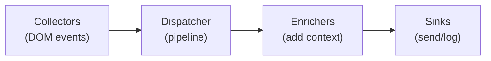

# Developing @releval/tracker

Notes for working on the tracker itself.
For usage documentation, see the [README](README.md).

## Project structure

```
src/tracker/
  src/
    attribution/      Object-keyed click-time attribution store
    collectors/       Declarative result click + impression collectors
    enrichers/        Built-in enrichers (options, browser, page, session, client ID)
    logging/          Logger interface, ConsoleLogger, safe wrapper
    react/            React adapter (provider, hooks, SearchResults context)
    sinks/            ConsoleSink, BatchSink
    storage/          Session manager, client ID, storage fallbacks
    types/            Event types (auto-generated from the UBI JSON schema)
    dispatcher.ts     Event pipeline orchestration
    tracker.ts        Main Tracker class
  scripts/
    generate-types.mjs     Codegen: fetches UBI schema, merges overrides, emits Event.ts
    schema-overrides.json  Partial JSON schema overrides (descriptions, extensions, required)
  tsdown.config.ts    Build configuration
  package.json
examples/
  html-script/        IIFE script tag example
  react-spa/          React ESM example
```

## Development commands

All commands run from `src/tracker/`:

```bash
npm install              # Install dependencies
npm test                 # Run Jest tests
npm run test:watch       # Run tests in watch mode
npm run build            # Build all formats with tsdown
npm run typecheck        # Type-check without emitting
npm run lint             # Lint with Biome
npm run lint:fix         # Auto-fix lint issues
npm run docs:check       # Validate API doc completeness (TypeDoc)
npm run generate:types   # Regenerate Event types from UBI JSON schema
npm run watch            # TypeScript watch mode
```

From the repo root:

```bash
npm run test:e2e          # Run the example apps end-to-end
npm run test:integration  # Boot a real Releval + ClickHouse stack (Testcontainers) and assert rows land
```

The integration suite is the regression gate for the wire contract: it runs the tracker against a real Releval image on every CI run.
It pulls a ~1.3 GB image, so it is slower than the other suites and needs a working Docker daemon.
The credentials in `integration/harness.ts` bootstrap the throwaway containers that suite creates; they exist only for the duration of a run.

## Architecture



The declarative collectors resolve DOM interactions into result data and route them through the high-level API; SPAs call the high-level API directly.
The **Dispatcher** stamps `timestamp`, `event_attributes.event_id` (a ULID, so retried deliveries stay deduplicable in analysis) and `event_attributes.tracker.version`, then runs **Enrichers** that add context.
**Sinks** deliver the enriched event - the console, the batching API sink, or a consumer-supplied one.

### Built-in enrichers

| Enricher | Adds |
|---|---|
| OptionsEnricher | `application`, `user_id`, `site_id` |
| SessionEnricher | `session_id` |
| ClientIdEnricher | `client_id` |
| BrowserEnricher | `event_attributes.browser` (user agent, language, screen; `webdriver: true` when automation is detected) |
| PageEnricher | `event_attributes.page` (URL, title, referrer) |

### Built-in sinks

| Sink | Description |
|---|---|
| `ConsoleSink` | Logs events to the browser console (default when no endpoint) |
| `BatchSink` | Queues events, flushes in batches with retry and full-jitter backoff. Uses the Beacon API on page unload (with a keepalive `fetch` fallback), and persists failed batches to `localStorage` - bounded by count and age - for retry on the next load. Used automatically when `endpointHost` is set. |

## Type generation

`src/types/Event.ts` is auto-generated from the [UBI event schema](https://o19s.github.io/ubi/schema/1.3.0/event.schema.json).
Do not edit it manually; run `npm run generate:types` to regenerate.

`scripts/generate-types.mjs` fetches the upstream JSON schema, deep-merges `scripts/schema-overrides.json` onto it, and emits TypeScript interfaces.
`schema-overrides.json` mirrors the JSON schema structure: it overrides fields that differ from upstream and declares the Releval extensions (`site_id`, `event_attributes.event_id`, `event_attributes.tracker`).
If the Releval server's `TrackEvent` contract changes, this overrides file is what keeps the generated types in sync - update it and regenerate.

## Build outputs

| Format | Path | Usage |
|---|---|---|
| ESM | `dist/releval-tracker.mjs` | Bundlers (Vite, Webpack, Rollup) |
| CJS | `dist/releval-tracker.cjs` | Node / CommonJS `require()` |
| IIFE | `dist/releval-tracker.global.js` | `<script>` tag - exposes `window.Releval` |
| React | `dist/react.mjs`, `.cjs` | `@releval/tracker/react` subpath (optional React peer dep, `'use client'`) |
| Types | `dist/releval-tracker.d.mts`/`.d.cts`, `dist/react.d.mts`/`.d.cts` | TypeScript declarations |
